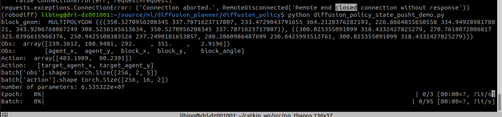

# diffusion_policy_state_pusht_demo.py代码总结

```
，我现在需要总结这个Python代码。看起来这是一个关于使用扩散策略（diffusion policy）在Push-T环境中进行演示和训练的代码。首先，我需要理清楚代码的结构和各个部分的功能。

首先，代码开头安装了一些必要的库，比如PyTorch、diffusers、Zarr等。然后导入了一系列模块，包括numpy、torch、gym、pygame等。接下来定义了PushTEnv类，这是一个基于PyMunk的推块环境，目标是将灰色的T型块推入绿色区域。环境包括物理模拟、观察空间、动作空间、重置和步骤函数等。

然后是关于数据集的部分，定义了PushTStateDataset类，用于加载和预处理Zarr格式的数据集，包括数据的标准化和序列采样。接着是神经网络部分，定义了一个条件UNet模型ConditionalUnet1D，用于预测扩散过程中的噪声。训练部分使用了DDPMScheduler，优化器是AdamW，并采用了指数移动平均（EMA）来稳定训练。

最后是推理部分，使用训练好的模型在环境中执行动作，并进行可视化。代码中还包含了一些辅助函数，如数据标准化、创建样本索引等。

在总结时，我需要指出代码的主要组成部分：环境设置、数据集处理、扩散模型的定义与训练、以及推理过程。同时，要说明各部分如何协同工作，例如如何使用扩散模型在环境中生成动作，并通过PD控制执行这些动作以达到目标。

可能还需要注意代码中的关键参数，如预测视野（pred_horizon）、观察视野（obs_horizon）、动作视野（action_horizon）等，这些参数影响了模型的输入输出结构和训练过程。此外，数据预处理步骤中的标准化和序列采样方法也是关键点。

在理解过程中，我可能会对某些部分不太清楚，比如扩散模型的具体实现细节，或是环境中的物理模拟如何与动作执行结合。但根据代码结构和注释，可以大致推断出各部分的功能和流程。

总的来说，这段代码实现了一个基于扩散策略的强化学习系统，用于解决Push-T环境中的物体推动任务。通过扩散模型生成动作序列，结合物理模拟环境进行训练和推理，最终达到目标。
```


该Python代码实现了一个基于扩散策略（Diffusion Policy）的强化学习系统，用于解决Push-T环境中的物体推动任务。以下是代码的主要组成部分和功能总结：

---

### **1. 环境设置（PushTEnv）**
- **目标**：将灰色T型块推入绿色目标区域。
- **关键组件**：
  - **物理引擎**：基于PyMunk实现刚体动力学模拟（如碰撞检测、力的作用）。
  - **观察空间**：包含智能体位置、T型块位置和角度（5维向量：`[agent_x, agent_y, block_x, block_y, block_angle]`）。
  - **动作空间**：二维连续空间，表示智能体的目标位置（`[target_x, target_y]`）。
  - **奖励计算**：根据T型块与目标区域的重叠比例（覆盖率）计算奖励，覆盖率超过95%视为成功。
  - **渲染**：支持PyGame可视化，可输出RGB图像或视频。

---

### **2. 数据集处理（PushTStateDataset）**
- **数据加载**：从Zarr格式的存储中读取预训练数据（状态和动作序列）。
- **数据预处理**：
  - **标准化**：将观测和动作数据归一化到`[-1, 1]`区间。
  - **序列采样**：生成固定长度的序列（`pred_horizon`），填充序列边界以保证连续性。
- **关键参数**：
  - `pred_horizon`：预测的动作序列长度（默认为16）。
  - `obs_horizon`：用于条件生成的观测历史长度（默认为2）。
  - `action_horizon`：实际执行的动作步数（默认为8）。

---

### **3. 扩散模型（ConditionalUnet1D）**
- **网络结构**：
  - 基于1D UNet，包含下采样和上采样模块。
  - 使用**条件残差块**（ConditionalResidualBlock1D），通过FiLM机制将观测条件（`global_cond`）注入模型。
  - 扩散步骤编码：通过正弦位置编码（`SinusoidalPosEmb`）表示时间步。
- **输入输出**：
  - 输入：带噪声的动作序列、扩散时间步、观测条件（拼接后的历史观测）。
  - 输出：预测的噪声（用于去噪）。

---

### **4. 训练过程**
- **优化器**：AdamW，学习率使用余弦调度（含线性热身）。
- **噪声调度器**：DDPMScheduler，配置为100步扩散，采用平方余弦噪声计划（`squaredcos_cap_v2`）。
- **训练策略**：
  - 指数移动平均（EMA）：提升模型稳定性。
  - 损失函数：均方误差（MSE）损失，用于噪声预测。

---

### **5. 推理与部署**
- **动作生成**：
  1. 从高斯噪声初始化动作序列。
  2. 通过扩散模型迭代去噪，生成平滑的动作序列。
  3. 仅执行前`action_horizon`步动作（减少计算开销）。
- **环境交互**：
  - 每步执行动作后更新观测队列（`obs_deque`），用于下一轮条件生成。
  - 最大交互步数限制为200步，避免无限循环。

---

### **6. 可视化与评估**
- **渲染**：通过PyGame实时渲染环境状态，并保存为视频（`vis.mp4`）。
- **评估指标**：最大覆盖率（`max(rewards)`），超过95%视为任务成功。

---

### **关键参数与依赖**
- **依赖库**：PyTorch、Diffusers、PyMunk、Gym、Zarr。
- **硬件加速**：模型训练需GPU（代码中指定`device = 'cuda'`）。

---

### **总结**
该代码通过扩散模型生成连续动作序列，结合物理模拟环境（PushTEnv）实现高效的物体推动策略。其核心创新点在于将扩散过程应用于强化学习的动作生成，通过迭代去噪生成平滑且多样化的动作，显著提升了策略的鲁棒性和泛化能力。


# 安装
```
Traceback (most recent call last):
  File "/home/libing/source/ml/diffusion_planner/diffusion_policy/diffusion_policy_state_pusht_demo.py", line 43, in <module>
    import shapely.geometry as sg
  File "/home/libing/miniconda3/envs/robodiff/lib/python3.11/site-packages/shapely/geometry/__init__.py", line 4, in <module>
    from .base import CAP_STYLE, JOIN_STYLE
  File "/home/libing/miniconda3/envs/robodiff/lib/python3.11/site-packages/shapely/geometry/base.py", line 20, in <module>
    from shapely.coords import CoordinateSequence
  File "/home/libing/miniconda3/envs/robodiff/lib/python3.11/site-packages/shapely/coords.py", line 10, in <module>
    from shapely.geos import lgeos
  File "/home/libing/miniconda3/envs/robodiff/lib/python3.11/site-packages/shapely/geos.py", line 94, in <module>
    _lgeos = CDLL(os.path.join(sys.prefix, 'lib', 'libgeos_c.so'))
             ^^^^^^^^^^^^^^^^^^^^^^^^^^^^^^^^^^^^^^^^^^^^^^^^^^^^^
  File "/home/libing/miniconda3/envs/robodiff/lib/python3.11/ctypes/__init__.py", line 376, in __init__
    self._handle = _dlopen(self._name, mode)
                   ^^^^^^^^^^^^^^^^^^^^^^^^^
OSError: /home/libing/miniconda3/envs/robodiff/lib/libgeos_c.so: cannot open shared object file: No such file or directory

```

确认本地是有这些库的, 直接拷贝一份
```
locate libgeos_c.so
/snap/cloudcompare/208/usr/lib/x86_64-linux-gnu/libgeos_c.so.1
/snap/cloudcompare/208/usr/lib/x86_64-linux-gnu/libgeos_c.so.1.10.2
/usr/lib/x86_64-linux-gnu/libgeos_c.so
/usr/lib/x86_64-linux-gnu/libgeos_c.so.1
/usr/lib/x86_64-linux-gnu/libgeos_c.so.1.13.1

```

```
cp /usr/lib/x86_64-linux-gnu/libgeos_c* /home/libing/miniconda3/envs/robodiff/lib/
```


下载权限问题
直接下载好一份，放在本地
```
Traceback (most recent call last):
  File "/home/libing/miniconda3/envs/robodiff/lib/python3.11/site-packages/urllib3/connectionpool.py", line 787, in urlopen
    response = self._make_request(
               ^^^^^^^^^^^^^^^^^^^
  File "/home/libing/miniconda3/envs/robodiff/lib/python3.11/site-packages/urllib3/connectionpool.py", line 534, in _make_request
    response = conn.getresponse()
               ^^^^^^^^^^^^^^^^^^
  File "/home/libing/miniconda3/envs/robodiff/lib/python3.11/site-packages/urllib3/connection.py", line 516, in getresponse
    httplib_response = super().getresponse()
                       ^^^^^^^^^^^^^^^^^^^^^
  File "/home/libing/miniconda3/envs/robodiff/lib/python3.11/http/client.py", line 1395, in getresponse
    response.begin()
  File "/home/libing/miniconda3/envs/robodiff/lib/python3.11/http/client.py", line 325, in begin
    version, status, reason = self._read_status()
                              ^^^^^^^^^^^^^^^^^^^
  File "/home/libing/miniconda3/envs/robodiff/lib/python3.11/http/client.py", line 294, in _read_status
    raise RemoteDisconnected("Remote end closed connection without"
http.client.RemoteDisconnected: Remote end closed connection without response

During handling of the above exception, another exception occurred:

```

终于跑起来了




# pusht_demo
手动推小球，可以感受下这个动作
```
python demo_pusht.py -o pusht_output
```

对鼠标的控制，经过PD control转化为agent的速度, 然后用这个速度去更新pymunk env中的物理模型

# 观测有哪些？
agent位置, block位置和block角度
[agent_x, agent_y, block_pos_x, block_pos_y, block_angle]
目标位置不需要放入观测吗？


block的目标位置goal_pos是写死的
# x, y, theta (in radians)
self.goal_pose = np.array([256, 256, np.pi/4])


# action之间的约束关系？
pred_horizon = 16 
action_dim = 2
key `action`: shape (pred_horizon, action_dim)


# 过程


# SED & ODE
这里有篇文章讲解的非常好
https://zhuanlan.zhihu.com/p/698737562